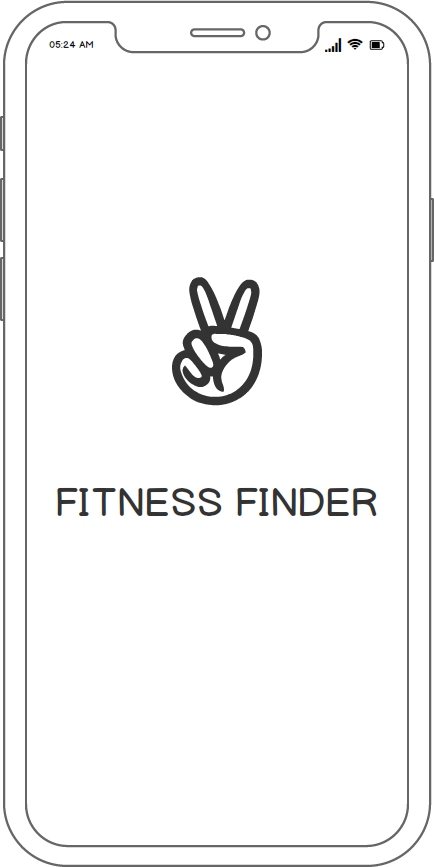

# Project3
Final project for the KU coding bootcamp. 

# Technologies Used  
-React  
-Node  
-Express  
-HTML5  
-CSS  
-Javascript

# Created by
Jacqueline Kolze  
Savannah Niemeyer

# Links
https://fitnessfinder.herokuapp.com  
https://jkolze1.github.io/Project3/

## Process
